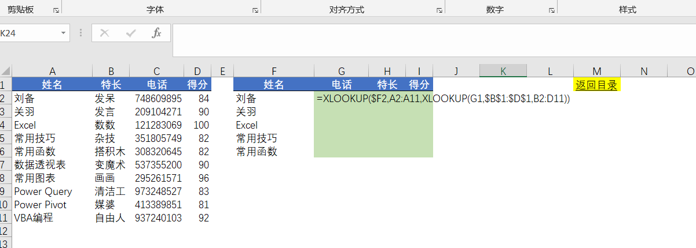
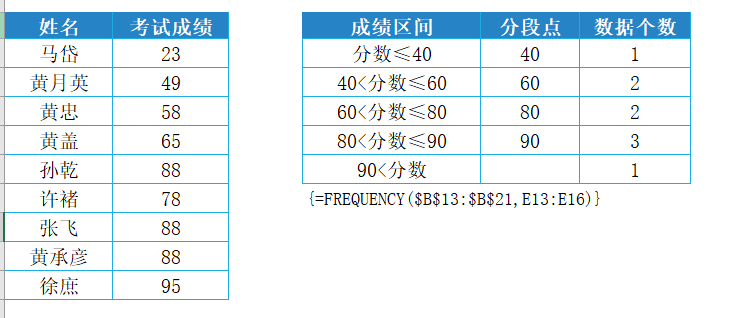
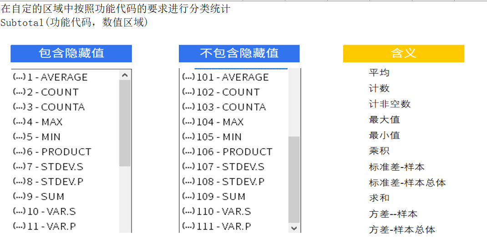
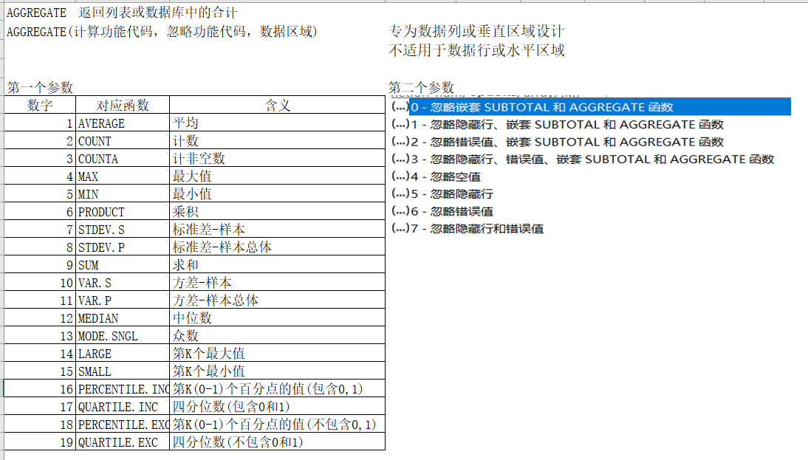
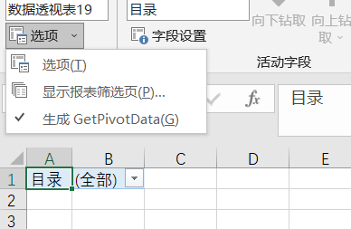

# 365函数

## 一. FILTER

相当于动态高级筛选

```
FILTER(返回区域,判断条件,[错误显示的值])														
区域:	返回区域,返回多少列就选择多少列													
判断条件:	返回逻辑值TRUE/FALSE的判断						多条件同时成立,条件使用乘法;任一成立,条件使用加法							
错误显示的值:	判断条件返回的值都是FALSE,返回的值,省略返回空值													
filter函数无需任何混合/绝对引用,无需下次下拉填充														
```

## 二. UNIQUE

```
unique(数据区域,[按列或行去重],[提取唯一值/非重复数值])									
数据区域:	要提取的非重复数值的区域								
按列或行去重:	
	0/省略:	比较行并返回唯一行							
	1:	比较列并返回唯一列							
提取唯一值/非重复数值:	
	1:	返回区域或数组中只出现过一次的所有非重复行或列							
	0或省略:	表示提取所有的非重复数值							
```

## 三. SORT

```
SORT(数据,[按第N列排序],[升序或降序],[按行或列排序])								
数据:	可以是一行/列或多行/列数据							
[按第N列排序]:	按几列排序就输入数字几,省略按第一列排序							
[升序或降序]:	1是升序,-1是降序,省略为升序							
[按行或列排序]:	True是按行,False按列,省略按列排序							
```

## 四. SORTBY

```
SORTBY	依据多个关键字（多行或多列)进行排序。								
SORTBY(array,by_array1,[sort_order1],[by_array2,sort_order2],...) 									
array	要进行排序的数组或区域								
by_array1	要对其进行排序的数组或区域								
[sort_order1]	要用于排序的顺序。 1表示升序,-1 表示降序。 默认值为 "升序"。								
	如果排序顺序参数不为 -1 或 1,则公式将导致 #VALUE! 错误.								
									
注意事项:	By_array 参数必须为一行高或一列宽								
	所有参数必须大小相同								

```

## 五. SEQUENCE

可产生动态序列

```
SEQUENCE(行,列,[开始数],[增量])	
返回数值系列	
rows	要返回的行数
[columns]	要返回的列数
[start]	序列中第一个数字
[step]	数组中每个连续值递增的值，可以为负值，小数
```

## 六. RANKARRAY

```
RANDARRAY			返回一组随机数字 可指定要填充的行数和列数、最小值和最大值，以及是否返回整数或小数值								
RANDARRAY([rows],[columns],[min],[max],[whole_number])											
RANDARRAY([行数],[列数],[最小值],[最小值],[小数还是整数])											
TRUE：表示整数		FALSE（或省略）：表示小数		
```

## 七. XLOOKUP

```
XLOOKUP(lookup_value,vlookup_array,return_array,[if_not_found],[match_mode],[search_mode])											
XLOOKUP(查找值,查找区域,返回区域,[查找不到时返回值],[匹配模式],[搜索模式])											
											
匹配模式:	0	精确匹配.如果未找到,则返回#N/A.这是默认选项									
	-1	精确匹配.如果未找到,则返回下一个较小的项									
	1	精确匹配.如果未找到,则返回下一个较大的项									
	2	通配符匹配.									
											
											
搜索模式:	-1	从第一项到最后一项进行搜索									
	1	从最后一项开始执行反向搜索									
	2	二进制文件搜索(升序排序)									
	-2	二进制文件搜索(降序排序)									
											
		提高重新速度									
		二分法:先和一半比，比一半大就在排序大的那一半找，小就在另一半找，然后再取一半和一半比，直到找到								
```



## 八. FREQUENCY

```
FREQUENCY函数		返回指定区间范围内的频率统计												
FREQUENCY(data_array, bins_array)														
FREQUENCY(数据源，分段点)														
	数据源:	要对其频率进行计数的一组数值或对这组数值的引用。 如果 data_array 中不包含任何数值，则 FREQUENCY 返回一个零数组。												
	分段点:	要将 data_array 中的值插入到的间隔数组或对间隔的引用。 如果bins_array 中不包含任何数值，则 FREQUENCY 返回 data_array 中的元素个数												
		N个区间点（间隔数组元素）划分为N+1个区间，对于每一个区间点，统计小于等于区间点大于上一个区间点的值的个数，统计生成N+1个值，第一个值表示小于区间点值的个数。												
														
注意:														
	FREQUENCY函数还可将忽略空白单元格和文本且函数支持乱序和重复数据。													
	但对于返回结果为数组的公式，必须以数组公式的形式输入。													
```



## 九. SUBTOTAL/AGGREGATE





## 十.制作目录

将函数定义名称

制作目录=MID(GET.WORKBOOK(1),FIND("]",GET.WORKBOOK(1))+1,99)

然后单元格输入=INDEX(制作目录,ROW(A1))，下拉

=HYPERLINK("#"&INDEX(制作目录,ROW(A1))&"!a1",INDEX(制作目录,ROW(A1)))

## 十一. 根据目录创建工作表

把目录内容创建数据透视表

把目录拖到筛选那里



点击显示报表筛选页