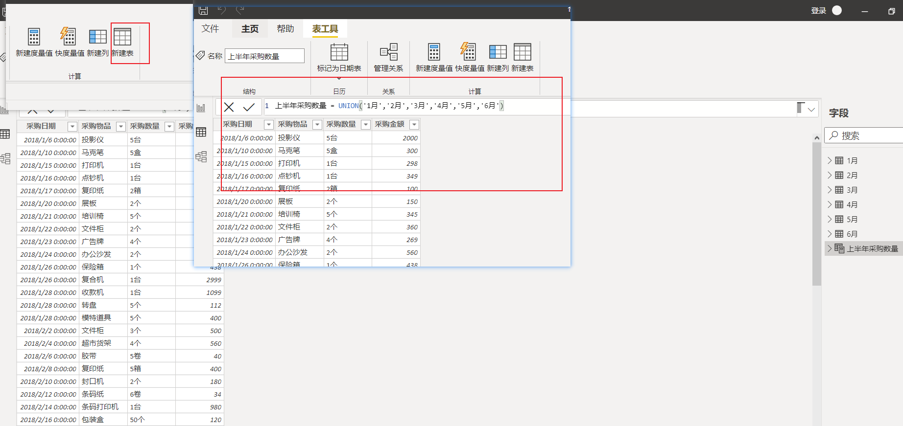

# DAX函数

## 一. 合并多个表

### UNION



## 二. 合并连接两个表

### NATURALINNERJOIN


## 三. 提取维度表

### distinct


ps:即提取唯一值

## 三. 查找

### 1.Lookupvalue

销售单价 = LOOKUPVALUE('商品表'[售价],'商品表'[商品编码],'销售表'[商品编码])


## 四.不同表列引用

### 1.related

从事实表到维度表查询，返回某列


### 2.relatetable

从维度表到事实表查询，返回某个表


## 五. Calculate函数(筛选)

### 1.普通使用


### 2.多类目筛选


## 六. Calculateable


calculateable对于日期操作看成不同表的列不能用&&，而用逗号，filter对于日期操作用&&，filter函数写日期参数会弹日期层次，而calculateable不会

## 七. Filter函数


配合calculate函数使用

filter与calculatetable区别

filter筛选条件只能为一列，而calculatetable的筛选条件可以为某个表格


## 八. 迭代函数


前面表参数可配合filter函数使用


## 九. 替换函数

和excel一样


## 十.ALL系列函数（清除筛选）


### 1.ALL

### 2.ALLSELECTED

### 3.ALLEXCEPT

### 4.ALLNOBLANKROW

## 十一.earlier

求累计销量

```
表1=filter('销售表','销售表'[货号]=earlier('销售表'[货号]))
表2=filter(表1,'销售表'[销售日期]=eaelier('销售表'[销售日期]))
累计销量=sumx(表2,'销售表'[销量])
```


## 十一. values&distinct

values函数，如果参数为列时，保留唯一值，删除重复行如果参数是表时，返回所有可见值，并保留重复行。只接受表名或者列名

distinct函数，如果参数是列或表时，保留唯一值,参数可以是表达式，表名或者列名

筛选filter中的某一列

```
CALCULATETABLE(VALUES('table'[Date]),FILTER('table','table'[Country]="Canada"&&'table'[Product]="Paseo")))
```


## 十二. SWITCH

## 十三. rankx


## 十四. divide

除法函数

## 十五.concatenate

讲两个文本文本字符串连接成一个文本字符串

## 十六. find&search

用法同excel

```
FIND(<find_text>, <within_text>, [ [<start_num>], [<NotFoundValue>]])
```

[理解 FIND 和 SEARCH (powerbigeek.com)](https://www.powerbigeek.com/understanding-find-search/)

## 十七. left&right&mid

用法同excel

## 十八.fixed

将数值舍入到指定的小数位数并将结果返回为文本。 可以指定返回的结果是否包含千分号。

[FIXED (powerbigeek.com)](https://www.powerbigeek.com/dax-functions-fixed/?f=1)


## 十九.Upper&Lower

转换大小写

## 二十.trim

去除空格

## 二十一.contains

## 二十二.日期函数


## 二十三.CURENCY


[CURRENCY (powerbigeek.com)](https://www.powerbigeek.com/dax-functions-currency/?f=1)

## 二十二.INT&TRUNC&ROUND

INT向下取值

TRUNC直接取整

ROUND四舍五入


## 二十三.CONVERT

转换表达式结果


## 二十四.summarizecolumns

```
SUMMARIZECOLUMNS ( <分组列>, [<分组列>], [<表筛选器>], [ [<列名>, <表达式>] … ] )
```


