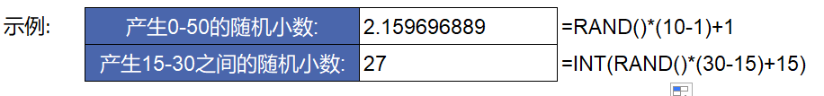
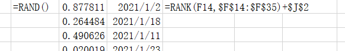
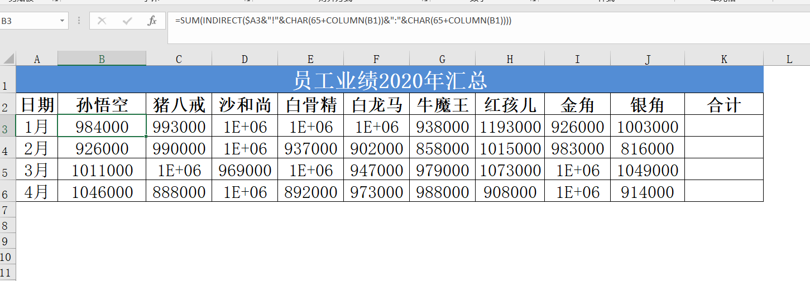

# 实战案例

## 一. 数学函数

### 1. 基本函数							

	向下取整	INT(number)			number:数字	
	四舍五入	ROUND(number, num_digits)			num_digits:保留几位小数	
	向上舍入数字	Roundup(number,num_digits)				
	向下舍入数字	Rounddown(number,num_digits)
	取余	MOD(number, divisor)			number:数字
	MOD(n, d) = n - d*INT(n/d) 			divisor：除数

注：

INT（时间)=年月日

MOD(时间，1)=时分秒

案例：

制作工资条

=INDEX(A:A,IF(MOD(ROW(),3)=1,1,IF(MOD(ROW(),3)=0,999,(ROW()+1)/3+1)))&""

=INDEX(D:D,CHOOSE(MOD(ROW(),3)+1,999,1,(ROW()+1)/3+1))&""

### 二. 随机函数

```
	返回0-1之间的随机小数	RAND()		bottom	最小值	
	返回介于数字之间的整数	RANDBETWEEN(bottom,top)		top	最大值	
	产生a-b之间的随机小数:	RAND()*(b-a)+a				
```



生成不重复随机数



### 三. 跨表引用



**用INDIRECT拼接表名**

### 四. 具体案例见素材

