# 数据可视化

## 一. 可视化的原则

1. 让数据更简单，更高效
2. 突出背后的规律
3. 突出重要的因素
4. 图形美观

## 二. 定性数据与定量数据

### 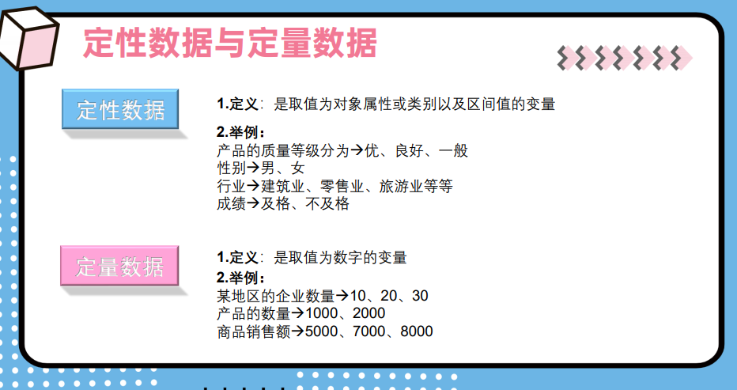

## 三. 图表类型（定性数据）

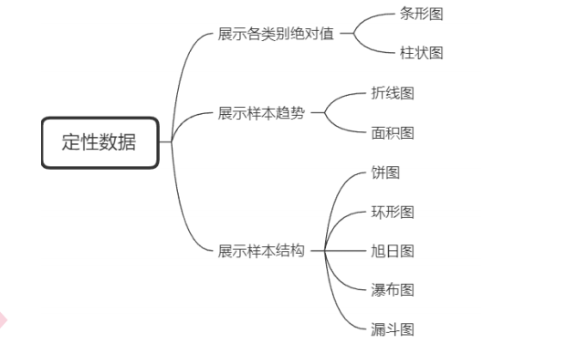

### 1. 柱状图

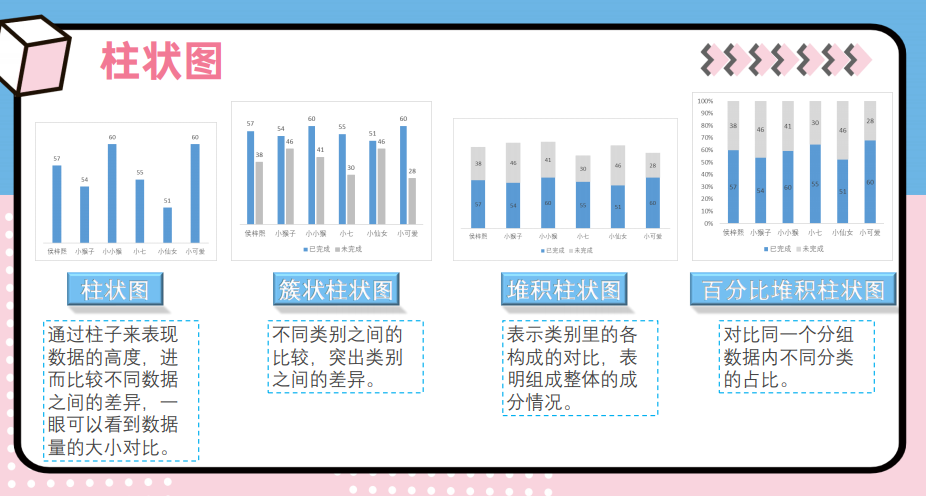

### 2. 条形图


### 3. 折线图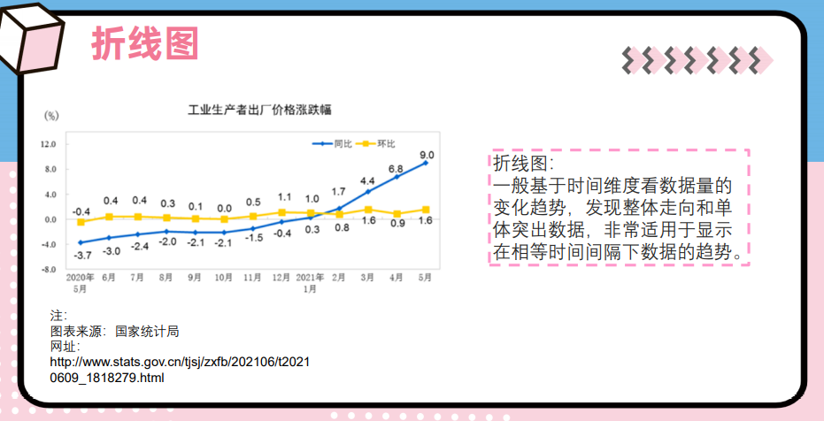

### 4. 面积图

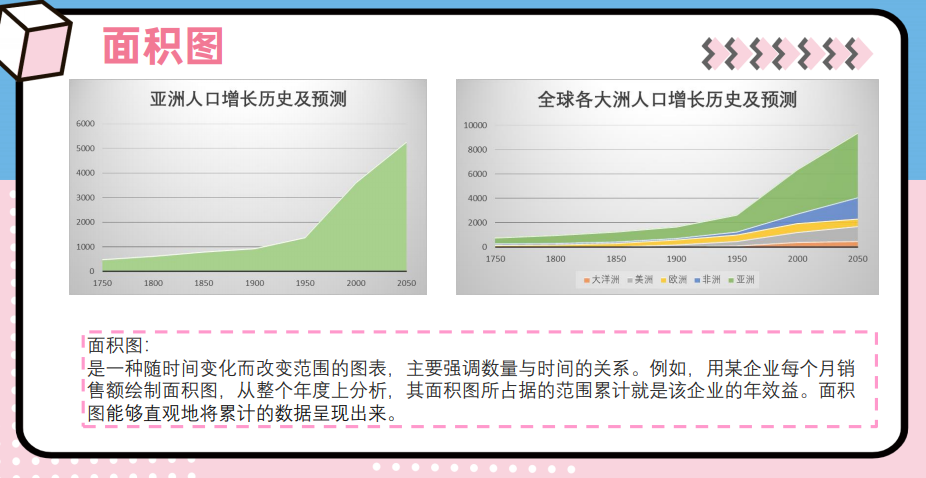

### 5. 饼图

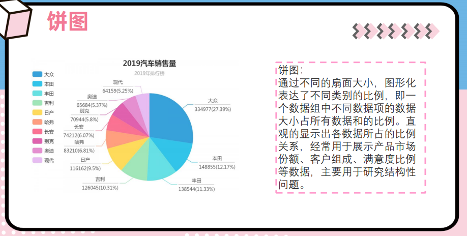

### 6. 环形图

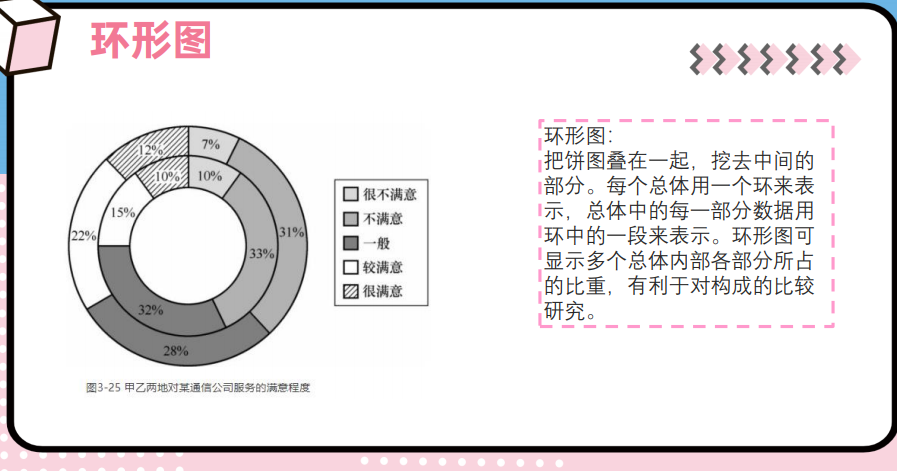

### 7. 旭日图

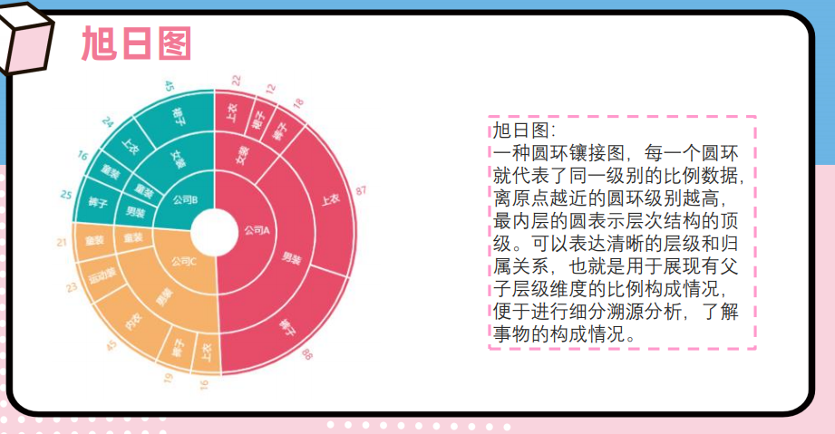

### 8. 瀑布图

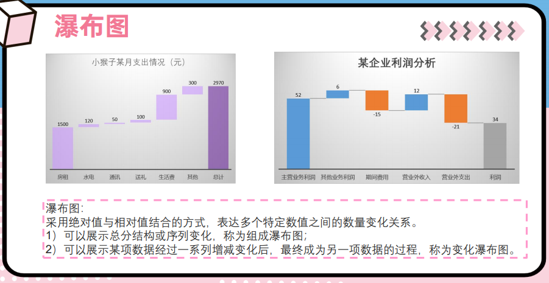

### 9. 漏斗图

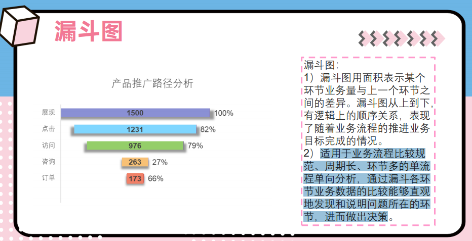

## 三. 图标类型（定量数据）

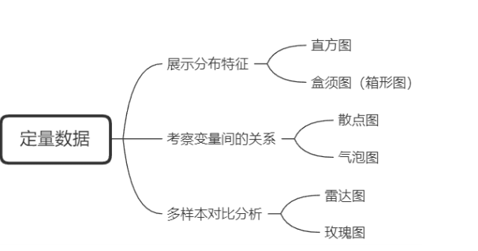

### 1. 直方图

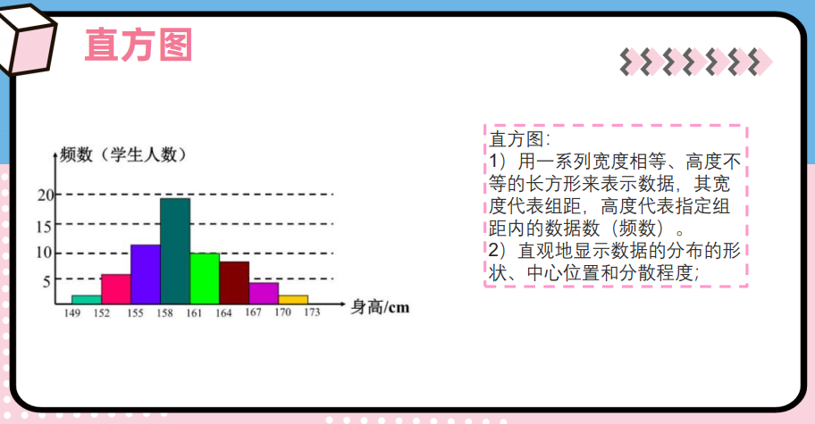

### 2. 箱形图

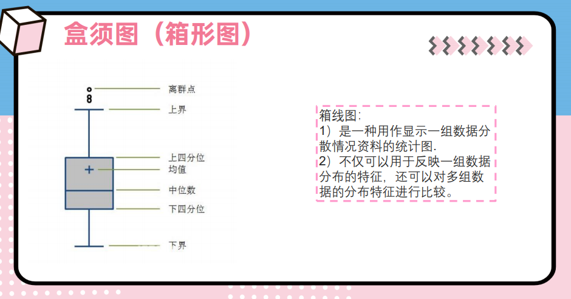

### 3. 散点图

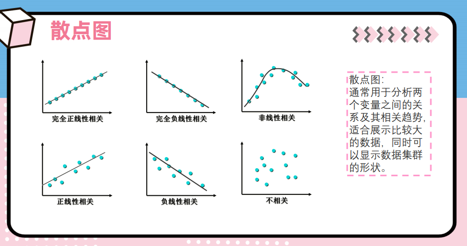

### 4. 气泡图

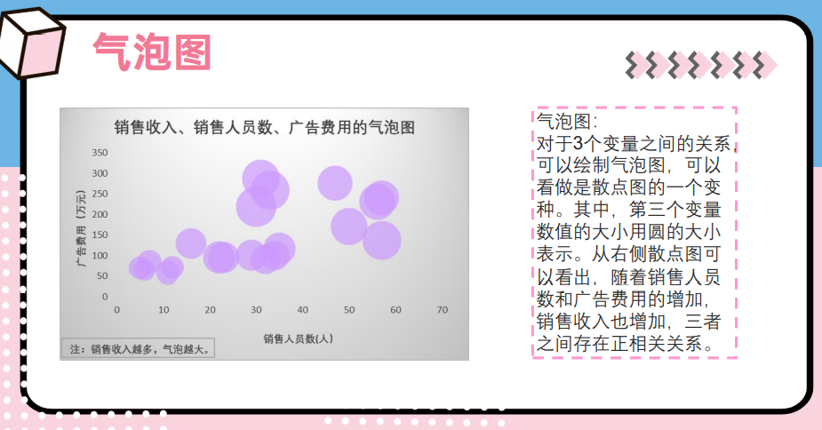

### 5. 标靶图

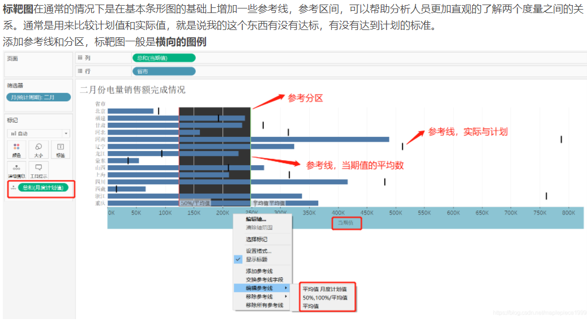

### 6. 雷达图

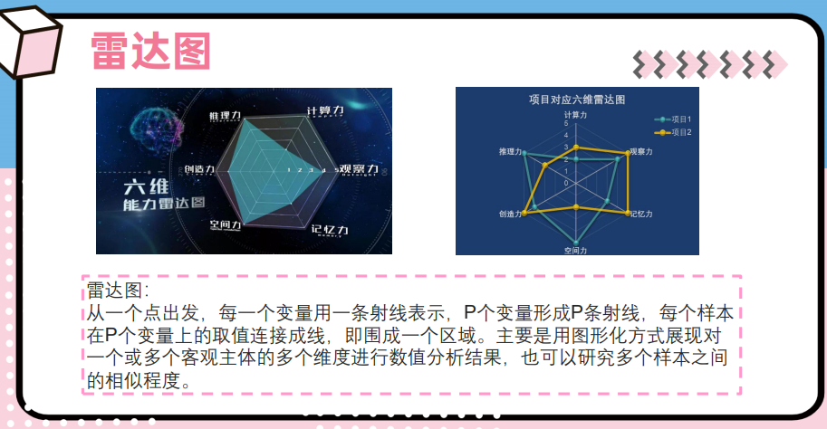

### 7. 玫瑰图

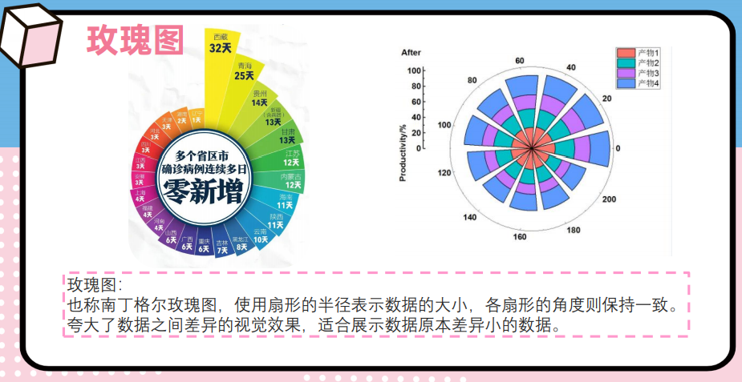

```mermaid

```

