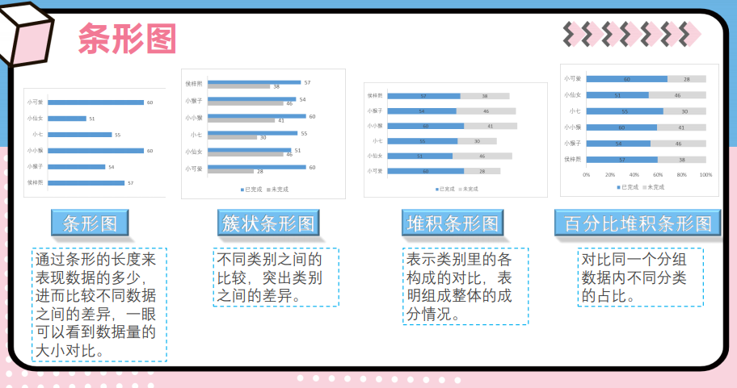

# 数据可视化

## 一. 可视化的原则

1. 让数据更简单，更高效
2. 突出背后的规律
3. 突出重要的因素
4. 图形美观

## 二. 定性数据与定量数据

### 

## 三. 图表类型（定性数据）


### 1. 柱状图


### 2. 条形图



### 3. 折线图

### 4. 面积图


### 5. 饼图


### 6. 环形图


### 7. 旭日图


### 8. 瀑布图


### 9. 漏斗图


## 三. 图标类型（定量数据）


### 1. 直方图


### 2. 箱形图


### 3. 散点图


### 4. 气泡图


### 5. 标靶图


### 6. 雷达图


### 7. 玫瑰图


```mermaid

```

