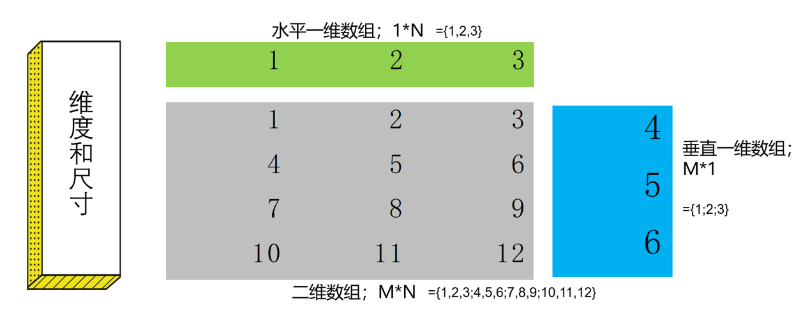

# 数组

## 一. 什么是数组

数组就是一组数据的集合，即由若干个元素组成的数据集合。
数组中的元素可以是数值、文本、逻辑值、日期时间等各种格式，甚至可以是错误值；											
在Excel中，数组就是一行数据、一列数据或多行多列数据元素的集合。											

**常见数组的类型**：区域数组、常量数组											
类型一：区域数组											
区域数组就是对Excel工作表的单元格区域直接引用。						
类型二：常量数组											
常量数组即数组中的每一个元素都是常量。(直接在大括号“{}”内直接输入元素的数组)											
用一对英文半角的大括号{}将所有元素括起来，用逗号,表示列与列的间隔，用分号;表示行与行的间隔。											

## 二. 数组的维度和尺寸

数组的维度指的是数组中的元素排列方向的个数。
当数组中的元素只有一个排列方向时，即只在一个方向上排列时，就是一维数组；
一维数组又按照排列方向的不同，分为水平一维数组（横向一维数组）和垂直一维数组（纵向一维数组）。

当数组中的元素有两个方向时，即同时包含行和列两个方向时，就是二维数组；
二维数组经常在工作表中表示为多行多列的单元格区域。
数组的尺寸指的是数组中各个方向上元素的多少。
一行N列的水平一维数组的尺寸是1\*N，M行一列的垂直一维数组的尺寸是M\*1；
M行N列的二维数组的尺寸是M*N；
通俗来说，很多人口中的数组的大小指的就是尺寸，数组越大，指在某个方向上包含的元素个数更多。

## 三. 数组的注意事项

数组公式是强制Excel执行多项计算的特殊公式，必须同时按下Ctrl+Shift+Enter三键输入公式；
数组公式用于对一组或多组值执行多项计算，返回单个或多个计算结果。

不要但凡公式就用三键输入，因为如果文件中包含大量数组公式后，可能会降低Excel的重算速度。
无论Excel再强大，终究还是个没有思想的工具，无从判断你输入的公式应该按照什么模式运算；
所以Ctrl+Shift+Enter这个三键组合按下的意义就在于，强制通知Excel按照多项计算模式执行运算

当数组公式返回多个计算结果时，必须同时选中同样大小的单元格区域输入数组公式，再按三键结束。
当选中的单元格区域小于计算结果的尺寸时，不足以展现全部的数组计算结果；
当选中的单元格区域大于计算结果的尺寸时，超出范围会出现#N/A错误。

## 四. SUMPRODUCT

基础语法					
	SUMPRODUCT(array1, [array2], [array3], ...)				
	先乘积后求和				
	所有Array参数必须具有相同的维数，即样貌相同				

## 五. MMULT

要求数组1的列数和数组2的行数相同，并且两个数组中都是数值数据。

用于两个矩阵的相乘

