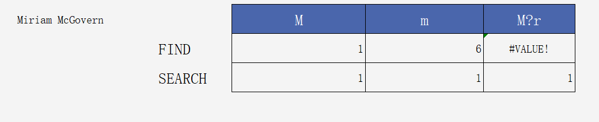
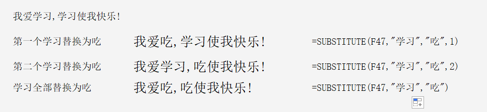
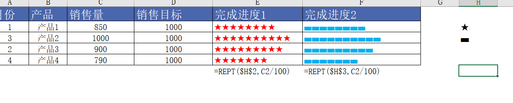
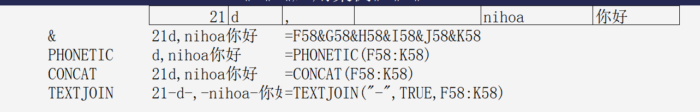
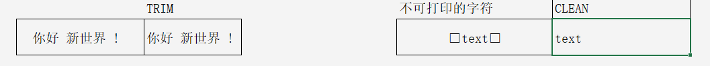
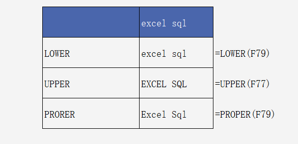

# 文本函数

## 一. LEN/LENB

返回字符/字节长度

```
LEN(text)		LEN(文本)		字符长度		字符是一个数字、文字、符号、英文各自为1个字符			
LENB(text)		LENB(文本)		字节长度		字节是一个中文、标点符号都各自为2个字节，英文、数字是1个字节	
```

## 二. LEFT/RIGHT/MID

```
LEFT(text,[num_chars])					LEFT(文本,截取个数)		
RIGHT(text,[num_chars])					RIGHT(文本,截取个数)		
MID(text, start_num, num_chars)					MID(文本, 开始位置,截取个数)		
```

LEFTB/RIGHTB/MIDB同一

## 三. FIND/FINDB&SEARCH/SEARCHB 

```
FIND(find_text, within_text, [start_num])					FIND(要查的文本, 被查的文本, 查的开始位置)				
SEARCH(find_text, within_text, [start_num])					SEARCH(要查的文本, 被查的文本, 查的开始位置)				
要查文本在被查的文本的第一个位置，返回的是一个数字，找不到返回 #VALUE!								查的开始位置省略则默认从1	
区别：
find()  识别大小写字母，不可以使用通配符									
search() 不识别大小写字母，可以使用通配符									
```



## 四. REPLACE/REPLACEB 

```
REPLACE(old_text,start_num,num_chars,new_text)								
REPLACE(文本, 起始位置, 替换几个字符, 新字段)						把给定的开始位置和长度的内容替换为其他内容		
```

REPLACE还可以连接字符串

=REPLACE(F3,1,0,REPT("0",6-LEN(F3)))

## 五. SUBSTITUTE

```
SUBSTITUTE(text, old_text, new_text, [instance_num])						[instance_num]省略则全部替换	
SUBSTITUTE(文本,被替换的字符,新的字符, 替换第几个)						对指定的字符进行替换	
```

例如：



## 六. REPT

	REPT(text,number_times)				
	REPT(文本,重复次数)  将文本重复一定的次数				



## 七. PHONETIC/CONCAT/TEXTJOIN

```
PHONETIC(reference)				PHONETIC(区域)		可引用区域,连接只识别文本		
CONCAT(text1,text2,…)						可引用区域,连接识别各种类型		
TEXTJOIN(delimiter,ingore_empty,text1,text2,…)						通过分隔符连接所有符合条件的单元格内容和区域		
TEXTJOIN(分隔符,是否忽略空白单元格,需要合并的字符串区域列表)								
```

例子：



## 八. TRIM/CLEAN

```
TRIM(text)		删除文本中不能打印的字符				
CLEAN(text)		除了单词之间的单个空格外，清除文本中所有的空格。				
```



## 九. LOWER/UPPER

```
LOWER(text)			小写	
UPPER(text)			大写	
PRORER(text)		首字母大写，其他小写	
```



## 十. FORMULATEXT

查看其它单元格函数的公式，把其他单元格的公式显示为纯文本

## 十一. CODE/CHAR

```
返回对应于数字代码的字符									
CHAR(number)			number		介于 1 到 255 之间用于指定所需字符的数字				
返回文本字符串中第一个字符的数字代码									
CODE(text)			text		要得到其第一个字符代码的文本				
```

常用符号的代码(也可以是汉字),可以点插入-->符号,然后用CODE获取数字代码,用ALT+数字健(小键盘输入)

## 十二. TEXT

```
将数值转换为文本，并且可以通过使用特殊格式字符串来指定显示格式						
TEXT(value,format_text)			TEXT(数值，格式)			
参考自定义格式		返回的一律都是文本形式的数据，若需要计算，需先转换为数值				
```

