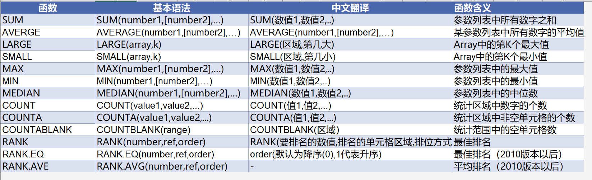

# 统计类函数

## 一. 基础统计函数



重点：

多表求和

=sum(点击首工作表+shift+尾工作簿，求和的量)

例子：=SUM('1月:12月'!C2)

## 二. 条件统计类函数

### 1. COUNTIF/COUNIFS

a. 单条件计数

- COUNTIF(range, criteria)		
  COUNTIF(条件区域，条件）

b. 多条件计数

COUNTIFS(criteria_range1, criteria1, [criteria_range2, criteria2], ...)											
COUNTIFS(条件1区域，条件1，条件2区域，条件2……条件N区域，条件N）											

### 2. SUMIF/SUMIFS

a. 单条件求和

	SUMIF(range, criteria, [SUM_range])													
	SUMIF(条件区域，条件，求和区域）													
注意事项：	如果省略sum_range参数，Excel会对在range参数中指定的单元格（即应用条件的单元格）求和

b.多条件求和

```
SUMIFS(sum_range, criteria_range1, criteria1, [criteria_range2, criteria2], ...)		
```


SUMIFS(求和区域，条件1区域，条件1，条件2区域，条件2……条件N区域，条件N）								

注意：SUMIF与SUNIFS参数区别，

求和区域求得是条件区域中按条件为ture的值

### 3. AVERAGEIF/VERRAGEIFS

a. 单条件求和

AVERAGEIF(range, criteria, [average_range])					
AVERAGEIF(条件区域，条件，求均值区域）					
b. 多条件求和

AVERAGEIFS(average_range, criteria_range1, criteria1, [criteria_range2, criteria2], ...)														
AVERAGEIFS(求均值区域，条件1区域，条件1，条件2区域，条件2……条件N区域，条件N）

### 4. MINIFS/MAXIFS

​    返回指定条件下的最小值

​	MINIFS(min_range,criteria_range1,cirterial1,criteria_range2, criteria2], ...)
​	MINIFS(返回值所在的区域，条件1区域，条件1，条件2区域，条件2……条件N区域，条件N）


​	返回指定条件下的最大值		

​	MAXIFS(max_range,criteria_range1,cirterial1,criteria_range2, criteria2], ...)									
​	MAXIFS(返回值所在的区域，条件1区域，条件1，条件2区域，条件2……条件N区域，条件N）												

